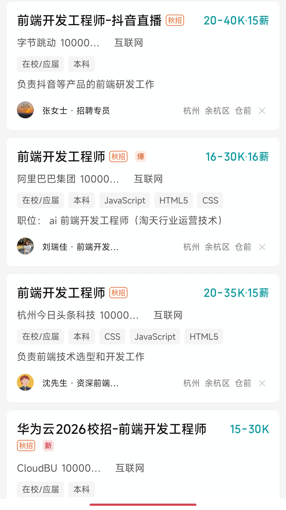

---
# You can also start simply with 'default'
theme: seriph
# random image from a curated Unsplash collection by Anthony
# like them? see https://unsplash.com/collections/94734566/slidev
background: https://cover.sli.dev
# some information about your slides (markdown enabled)
title: 网络、前端
# apply unocss classes to the current slide
class: text-center
# https://sli.dev/features/drawing
drawings:
  persist: false
# slide transition: https://sli.dev/guide/animations.html#slide-transitions
transition: slide-left
# enable MDC Syntax: https://sli.dev/features/mdc
mdc: true
# open graph
seoMeta:
  # By default, Slidev will use ./og-image.png if it exists,
  # or generate one from the first slide if not found.
  ogImage: auto
  # ogImage: https://cover.sli.dev
---

# 网络、前端

WEB 后端 9 月 1 日 20:00 开讲，这节课是为了垫点东西以便理解


---
transition: fade-out
layout: image-left
image: ./assets/image.png
---

# 先从网络模型讲起

左图为TCP/IP模型，为四层模型，偏向实际情况

选几个重要的来说

- 应用层: dns、http、dhcp、tls
- 传输层: tcp、udp
- 网络层: ip、icmp
- 数据链路层: arp


---
transition: slide-up
level: 2
---

# DNS

域名系统 (Domain Name System, DNS) 是互联网的电话簿。人们通过域名访问网站，而计算机通过 IP 地址进行通信。DNS 将域名转换为 IP 地址，使用户能够通过易记的名称访问网站。

```bash
nslookup hdu-cs.wiki
dig hdu-cs.wiki
```
```bash
www.hdu-cs.wiki
↑子域名
    ↑主域名
           ↑顶级域名 TLD （Top Level Domain）
```

https://dn11.top/mics/dns.html

---
layout: image
image: ./assets/Snipaste_2025-08-30_14-50-34.png
---

---
level: 2
---

# DHCP

动态主机配置协议 (Dynamic Host Configuration Protocol, DHCP) 是一种网络管理协议，用于自动分配 IP 地址和其他网络配置参数给网络中的设备。DHCP 服务器负责管理 IP 地址池，并在设备请求地址时分配可用地址。

https://info.support.huawei.com/info-finder/encyclopedia/zh/DHCP.html

---
level: 2
---

# HTTP

超文本传输协议 (Hypertext Transfer Protocol, HTTP) 是一种用于传输超文本数据的应用层协议。它是万维网 (WWW) 的基础，定义了客户端和服务器之间的通信规则。

HTTP 的主要特点包括：

- 无状态：每个请求都是独立的，服务器不会记住客户端的状态。
- 灵活性：支持多种数据格式，如 HTML、JSON、XML 等。
- 可扩展性：可以通过添加新的方法和头部字段来扩展协议。

重点：
- HTTP 版本 1.0/1.1/2.0/3.0
- HTTPS（HTTP Secure）：在 HTTP 的基础上，加入了 SSL/TLS 加密层，提供更安全的通信。
- HTTP 错误码 响应状态码 https://developer.mozilla.org/zh-CN/docs/Web/HTTP/Reference/Status
- HTTP 请求方法 https://developer.mozilla.org/zh-CN/docs/Web/HTTP/Reference/Methods
- HTTP 请求头、请求体、响应头、响应体
- RESTful API 设计原则


---

# TLS

TLS（Transport Layer Security，传输层安全协议）是一种用于在计算机网络中提供通信安全的加密协议。它通过加密数据传输、验证通信双方身份以及确保数据完整性来保护信息的机密性和完整性。

前身也叫 SSL（Secure Sockets Layer，安全套接字层），现已被 TLS 取代。

版本 1.0/1.1/1.2/1.3

HTTPS 签证书、握手、加密流量

Client Hello → Server Hello → `[密钥交换：RSA/DH/ECDHE]` → 完成握手

---
class: px-20
---

# TCP

TCP（Transmission Control Protocol，传输控制协议）是一种面向连接的、可靠的传输层协议。它通过在发送方和接收方之间建立连接，确保数据的可靠传输。

TCP 的主要特点包括：

- 面向连接：在数据传输之前，必须先建立连接。
- 可靠性：通过序列号、确认应答和重传机制，确保数据的可靠传输。
- 流量控制：通过滑动窗口机制，控制数据的发送速率，避免网络拥塞。
- 拥塞控制：通过慢启动、拥塞避免、快速重传和快速恢复等算法，控制网络拥塞。

listen、三次握手、四次挥手

主要用于浏览网页、视频等连接

---

# UDP

用户数据报协议（User Datagram Protocol，UDP）是一种无连接的、简单的传输层协议。与 TCP 不同，UDP 不会在发送数据之前建立连接，也不保证数据的可靠传输。

UDP 的主要特点包括：

- 无连接：在数据传输之前，不需要建立连接。
- 不可靠性：不保证数据的送达和顺序，丢包和重复数据都是可能的。
- 低延迟：由于没有连接建立和确认过程，UDP 的延迟较低。

主要用于实时应用，如视频会议、在线游戏等。


---

# IP

互联网协议（Internet Protocol，IP）是网络层的核心协议，负责在网络中传输数据包。IP 协议定义了数据包的格式、寻址方式和路由规则。

IP 的主要版本包括：

- IPv4：使用 32 位地址，支持约 42 亿个地址，现已接近耗尽。
  - `223.5.5.5`
- IPv6：使用 128 位地址，支持更大规模的地址空间，解决了 IPv4 的地址耗尽问题。
  - `240e:3327:1234:5678:90ab:cdef:1234:5678`

IP 数据包的基本结构包括：

- 版本号：指示使用的 IP 版本（IPv4 或 IPv6）。
- 源地址：发送方的 IP 地址。
- 目的地址：接收方的 IP 地址。
- 数据：实际传输的内容。

---

# ICMP

互联网控制消息协议（Internet Control Message Protocol，ICMP）是网络层的核心协议之一，主要用于在网络设备之间传递控制消息和错误报告。ICMP 协议通常与 IP 协议一起使用，作为 IP 数据包的一部分。

ICMP 的主要功能包括：

- 错误报告：当数据包在传输过程中出现问题时，ICMP 可以向源主机发送错误消息，例如目的不可达、超时等。

ICMP 消息的基本结构包括：

- 类型：指示消息的类型，例如回显请求、回显应答、目的不可达等。
- 代码：提供更具体的错误信息或消息类型。
- 校验和：用于检测消息在传输过程中是否发生错误。
- 数据：实际传输的内容，通常包括原始 IP 数据包的头部和前 8 字节。

```bash
ping 223.5.5.5
```

---

# ARP

地址解析协议（Address Resolution Protocol，ARP）是网络层的协议，用于将 IP 地址解析为 MAC 地址。ARP 主要用于局域网中，帮助设备找到同一网络中其他设备的物理地址。

ARP 的工作流程如下：

1. 设备 A 需要发送数据给设备 B，但只知道设备 B 的 IP 地址。
2. 设备 A 广播 ARP 请求，询问“谁拥有这个 IP 地址？”
3. 拥有该 IP 地址的设备 B 响应 ARP 请求，返回自己的 MAC 地址。
4. 设备 A 收到 MAC 地址后，将数据包发送给设备 B。

ARP 缓存：为了提高效率，设备会将已解析的 IP 地址和 MAC 地址存储在 ARP 缓存中，避免频繁的 ARP 请求。

```bash
arp -a
```

---
layout: center
class: text-center
background: https://cover.sli.dev
---

# 前端

WEB 前端课程讲的是单HTML文件怎么写，一个大型前端项目怎么面向用户，它是怎么编写、维护、提高效率的

前端怎么与后端交互的

前端怎么与用户交互的

前端框架有什么

前端语言有什么

前端工具链有什么

---

# 前端史

前端屎！

https://en.wikipedia.org/wiki/Front-end_web_development

前端是一个概念，描述的是通常的软件开发中面向用户，给用户提供简单操作界面的一面

我们这里的前端（现在前端这个词）主要指的是 Web 前端，涉及到的技术栈包括 HTML、CSS 和 JavaScript 等。

广义前端还包括移动端、桌面端等其他平台的前端开发。

前端起源要追溯到1990年，当时出现了世界上第一个浏览器 “WorldWideWeb（Nexus）” （不同于万维网和子域名缩写www） https://zh.wikipedia.org/wiki/%E7%BD%91%E9%A1%B5%E6%B5%8F%E8%A7%88%E5%99%A8

---

# 混乱标准（特性支持）

同一套代码，不同的浏览器可能会有不同的表现，导致开发者在调试和测试时面临挑战。

有一些特性不同浏览器不支持。（问题来了，为什么叫特性，谁提出的，为什么浏览器不支持）

特性是指浏览器支持的某些功能或行为，通常由 W3C（万维网联盟）等标准组织提出并定义。然而，由于各种原因（如市场竞争、技术实现难度等），不同浏览器对这些特性的支持程度可能存在差异。

[caniuse.com](https://caniuse.com/?search=view%20transition%20api)

这是一个用于查询浏览器支持情况的网站。例子填充了一个 View Transitions API 的用法。firefox就不支持。

---

# 混乱标准（JS版本支持）

JavaScript 并不是一种中心化形式的语言，即没有*官方编译器（解释器）*

不同的浏览器和环境可能会有不同的 JavaScript 引擎，例如 Chrome 的 V8、Firefox 的 SpiderMonkey 和 Safari 的 JavaScriptCore。这些引擎可能会实现不同版本的 ECMAScript 标准，导致同一段代码在不同环境下的表现不一致。

ECMAScript 是 JavaScript 的标准化版本，由 ECMA 国际组织制定。它定义了 JavaScript 的语法、类型、语句、关键字、保留字、内置对象等。不同版本的 ECMAScript 可能会引入新的特性和语法，导致在旧版引擎中无法运行。

常见的解释器：nodejs、Deno、Bun

常见的引擎：V8、SpiderMonkey、JavaScriptCore

---


# 混乱标准（ECMAScript 版本支持）

ECMAScript 分为两大版本：

- ES5：发布于 2009 年，主要引入了 JSON 支持、严格模式等特性。
- ES6（又称 ES2015）：发布于 2015 年，带来了大量新特性，如箭头函数、类、模块、Promise 等。

ES6 之后，ECMAScript 采用了年度发布的方式，每年都会引入一些新特性。

例如IE 11 只支持到 ES5

你想用一套代码覆盖IE的话，就需要使用 Babel 等工具进行转译，将 ES6+ 的代码转换为 ES5 代码。polyfill 是一种用于提供浏览器不支持的特性实现的技术。


---

# 混乱框架

最终用户看的无非是html、css、js这三个东西，大家就想出用框架来提升开发效率、统一规范、降低复杂度。

常见的前端框架有：

- React：一个用于构建用户界面的 JavaScript 库，强调组件化和虚拟 DOM。
- Vue：一个渐进式 JavaScript 框架，易于上手，适合构建单页面应用。

这些框架通过提供抽象和封装，帮助开发者更高效地构建复杂的用户界面。


---
layout: two-cols-header
---

# 混乱渲染策略

啥比前端

::left::

- SPA 单页应用
- CSR 客户端渲染
- SSR 服务端渲染
- SSG 静态网站生成
- ISR 增量静态生成
- RSC 服务器组件
- MPA 多页应用
- BFF 后端为前端
- Hydration 水合
- Partial Hydration 部分水合
- Progressive Enhancement 渐进增强

::right::

- Islands Architecture 岛屿架构
- Streaming SSR 流式服务端渲染
- Edge-Side Rendering (ESR) 边缘渲染
- Resume/Resumability 可恢复性（Qwik 等框架）
- Hybrid Rendering 混合渲染
- On-demand ISR 按需增量静态生成
- 微前端

--- 

# 前端最难的史 --- 状态管理

假设用户点击了某个东西，我们要更改状态

状态从组件间传递

状态从父组件传递到子组件，子组件通过 props 接收状态并进行渲染。

状态从子组件传递到父组件，通常通过事件回调的方式实现。

状态从前后端传递，通常通过 API 请求的方式实现。

状态从前端本地存储传递，通常通过 localStorage、sessionStorage 等方式实现。


---

# 经典前端入门项目 --- TODOLIST

https://www.hdu-cs.wiki/2023%E6%97%A7%E7%89%88%E5%86%85%E5%AE%B9/7.%E7%BD%91%E7%BB%9C%E5%BA%94%E7%94%A8%E5%BC%80%E5%8F%91/7.1WEB%E5%BC%80%E5%8F%91%E5%85%A5%E9%97%A8.html

https://todomvc.com/


--- 


# 职业发展

前端价格：本科、双非杭电、大厂、月薪 20K~30K （和后端基本一致）


<div class="flex flex-row gap-20">

  

  <div class="flex flex-col gap-3">
    <h3>路线要求</h3>
    <div>精通 HTML、CSS、JavaScript 基础知识</div>
    <div>精通常见前端框架 React、Vue 二选一</div>
    <div>熟悉前端构建工具（如 Webpack、Vite），熟悉性能优化，安全性</div>
    <div>在大三下参加实习，大四上之前起码要有一段实习经验</div>
    <div>拿的出手的项目两个以上（写进简历里的）</div>
    <div>掌握 Git 版本控制工具的使用</div>
    <div>多参与开源项目</div>
    <div>熟悉后端基础知识（如 RESTful API、数据库等）</div>
    <div>多参与校内外比赛（前端很好混的）</div>
    <div>不要求绩点，绩点没用（学习能力强就行）</div>
  </div>

</div>


---
layout: end
---

# 没了，下面开始答疑

